# Plant Data Management System — Database Schema (v1)

PostgreSQL 13+ (tested on 16.2). DDL: [`schema.sql`](schema.sql). Loader: [`seed/seed_from_json.py`](seed/seed_from_json.py).

```
LEGACY HTML  →  plantdata_export/structured/*.json  →  PostgreSQL (this schema)  →  API  →  new frontend
```

## Principles

1. **Source values are never rewritten.** Legacy values are stored as `text` exactly as extracted —
   including placeholders `N/A`, `NA`, `-`, `NIL`, `Nil`, `na`, `nA`. `NULL` only means the legacy
   element was empty or absent.
2. **Source vs. working copy.** Every legacy-derived row has *working* columns (what the app reads and
   edits) plus an immutable copy of the original (`source` JSONB, and `source_value` where a single value
   matters). Triggers reject changes to source columns once set. Rows created in the new app have
   `source = NULL`.
3. **Full snapshot.** `legacy_plant_records.record` holds each plant's complete structured JSON, plus the
   SHA-256 of the raw HTML it came from. Rows in this table cannot be updated or deleted, and a plant
   that has one cannot be deleted.
4. **Legacy identity = `legacy_plant_id`** (unique). `serial_number` is indexed but **not unique** —
   serials 3256, 2046 and 1704 are each shared by two plants, and those plants stay separate rows.
5. **Order is data.** Every list keeps the legacy row order in `position` (1-based, unique per parent,
   `DEFERRABLE` so rows can be reordered inside a transaction).
6. **No guessed meanings.** Filter values and unlabelled HP-accessory values stay unlabelled
   (`label` NULL). Equipment codes (`PK121`, `PK122(S)`, `PK1601`, `FE183`) are opaque text.
7. **Derived columns are optional helpers.** `value_numeric`, `motor_kw_numeric`, `motor_amp_numeric`
   (generated) and `quantity` / `module_type` (parsed at import) are filled only when the text is
   unambiguous, else `NULL`. The text column is always the record of truth.

## ER diagram

```mermaid
erDiagram
    import_batches ||--o{ legacy_plant_records : "imported in"
    zones          |o--o{ plants : "located in"
    plants ||--o{ legacy_plant_records : "immutable snapshot"
    plants ||--|{ plant_sections : "section presence + legacy count"
    plants ||--|{ plant_modules : "stages 1-5 + total"
    plants ||--o{ plant_design_parameters : "ordered, duplicates allowed"
    plants ||--o{ pumps_and_motors : ""
    plants ||--o{ instruments : ""
    plants ||--o{ hmi_plc : ""
    plants ||--o{ vfds : ""
    plants ||--o{ dosing_pumps : ""
    plants ||--o{ filters : ""
    filters ||--o{ filter_values : "ordered, unlabelled"
    plants ||--o{ hp_pump_accessory_groups : ""
    hp_pump_accessory_groups ||--o{ hp_pump_accessory_entries : "label/value pairs"

    plants {
        bigint id PK
        int legacy_plant_id UK "nullable for new plants"
        text name
        text display_name "legacy dropdown label"
        text serial_number "indexed, NOT unique"
        text capacity
        text site_contact_number
        bigint zone_id FK
        jsonb source
    }
    zones {
        bigint id PK
        text name UK
    }
    legacy_plant_records {
        bigint id PK
        bigint import_batch_id FK
        bigint plant_id FK
        int legacy_plant_id
        jsonb record "full structured JSON"
        text raw_file
        text raw_sha256
    }
    import_batches {
        bigint id PK
        text source_path
        text schema_version
        int record_count
    }
    plant_sections {
        bigint id PK
        bigint plant_id FK
        text section
        bool rendered_in_legacy
        int legacy_count
    }
    plant_modules {
        bigint id PK
        bigint plant_id FK
        int position
        smallint stage "1-5, NULL on total"
        bool is_total
        text value_text "e.g. 3(HPRO)"
        int quantity "parsed"
        text module_type "parsed"
        text source_value
    }
    plant_design_parameters {
        bigint id PK
        bigint plant_id FK
        int position
        text parameter_name
        text value
        text unit
        numeric value_numeric "generated"
        text source_value
        jsonb source
    }
    pumps_and_motors {
        bigint id PK
        bigint plant_id FK
        int position
        text equipment_code
        text pump_make
        text pump_model
        text motor_make
        text motor_kw
        text motor_amp
        numeric motor_kw_numeric "generated"
        numeric motor_amp_numeric "generated"
        jsonb source
    }
    instruments {
        bigint id PK
        bigint plant_id FK
        int position
        text name
        text make
        text model
        jsonb source
    }
    hmi_plc {
        bigint id PK
        bigint plant_id FK
        int position
        text name
        text make
        text model
        jsonb source
    }
    vfds {
        bigint id PK
        bigint plant_id FK
        int position
        text name
        text make
        text model
        jsonb source
    }
    dosing_pumps {
        bigint id PK
        bigint plant_id FK
        int position
        text dosing_pump_for
        text make
        text model
        jsonb source
    }
    filters {
        bigint id PK
        bigint plant_id FK
        int position
        text name
        jsonb source
    }
    filter_values {
        bigint id PK
        bigint filter_id FK
        int position
        text label "NULL = unknown"
        text value
        text source_value
        jsonb source
    }
    hp_pump_accessory_groups {
        bigint id PK
        bigint plant_id FK
        int position
        text group_name
        jsonb source
    }
    hp_pump_accessory_entries {
        bigint id PK
        bigint group_id FK
        int position
        text label "NULL when legacy had none"
        text value
        jsonb source
    }
```



`change_log` (not drawn) is append-only and written by the `log_change` trigger on INSERT/UPDATE/DELETE of
every data table. It records `plant_id`, `changed_by`, `reason` and `request_id`, and has no FKs, so
entries outlive deleted rows. The initial legacy import is not logged row by row (`pdm.bulk_import`);
it is recorded in `import_batches`.
Every data table also has `created_at` / `updated_at` (`timestamptz`, `updated_at` maintained by trigger).

## JSON → table mapping

| Structured JSON                     | Table / column(s)                                                                 |
|-------------------------------------|-----------------------------------------------------------------------------------|
| `plant_id`                          | `plants.legacy_plant_id`                                                          |
| `plant.name`                        | `plants.name` (lower-case as in legacy HTML)                                      |
| `source.dropdown_label`             | `plants.display_name` (verbatim, original casing, incl. odd spacing)              |
| `plant.serial_number / capacity / site_contact_number` | `plants.*`                                                     |
| `zone`                              | `zones.name` ← `plants.zone_id`                                                   |
| `modules.stage_1..stage_5`, `total` | `plant_modules` (stage 1–5 rows + one `is_total` row)                             |
| `design_parameters[]`               | `plant_design_parameters` (`unit` = parentheses removed; `source.unit_raw` keeps e.g. `(m³/Hr.)`) |
| `pump_and_motor[]`                  | `pumps_and_motors` (`pump_code` → `equipment_code`)                               |
| `instruments[]`, `hmi_and_plc[]`, `vfd[]`, `dosing_pumps[]` | `instruments`, `hmi_plc`, `vfds`, `dosing_pumps`          |
| `filters[].values[]`                | `filters` → `filter_values` (ordered)                                             |
| `hp_pump_accessories[].entries[]`   | `hp_pump_accessory_groups` → `hp_pump_accessory_entries` (ordered)                |
| section `null` vs `[]`              | `plant_sections.rendered_in_legacy` false / true                                  |
| `legacy_counts`                     | `plant_sections.legacy_count`                                                     |
| whole record + `source.*`           | `legacy_plant_records`                                                            |

Module parsing: `3(HPRO)`→(3,`HPRO`), `2 (ST)`→(2,`ST`), `8(ST PT)`→(8,`ST PT`), `17 PT`→(17,`PT`),
`2(NA)`→(2,`NA`), `0`→(0,NULL). All 1,032 legacy module values match one of these forms.

## Constraints and why they exist

| Constraint | Reason |
|---|---|
| `plants.legacy_plant_id` UNIQUE (nullable) | Authoritative legacy identity; new-app plants have none. |
| `zones.name` UNIQUE | Lookup table. |
| `UNIQUE (parent_id, position)` on every ordered child | One row per position keeps order well-defined. Deferrable for reordering. |
| `plant_modules`: `UNIQUE (plant_id, stage)` + one total per plant + stage/is_total CHECK | Legacy has exactly stages 1–5 + total. |
| `plant_sections`: `UNIQUE (plant_id, section)` + section CHECK | One presence flag per section. |
| `legacy_plant_records`: `UNIQUE (import_batch_id, legacy_plant_id)` | One snapshot per plant per import. |
| **Not unique:** `serial_number`, `parameter_name` per plant, equipment codes, names | Legacy data legitimately repeats them. |

Indexes: every FK (via the leading column of the `(parent_id, position)` unique index or an explicit
index), `plants(serial_number)`, `plants(zone_id)`, `plants(lower(name))`,
`plant_design_parameters(parameter_name)`, `pumps_and_motors(equipment_code)`, and `lower(make)` on the
equipment tables for search.

## Correcting / normalising data later

```sql
BEGIN;
SET LOCAL pdm.changed_by    = 'jane@example.com';
SET LOCAL pdm.request_id    = 'manual-2026-09-21';
SET LOCAL pdm.change_reason = 'Unify conductivity unit spelling';
UPDATE plant_design_parameters SET unit = 'µS/cm' WHERE unit IN ('µS/CM', 'μS/CM', 'μs/cm');
COMMIT;
```

- The working column changes; `source` / `source_value` keep the original; `change_log` records old
  value, new value, who and why.
- Compare working vs. original at any time, e.g.
  `SELECT * FROM plant_design_parameters WHERE value IS DISTINCT FROM source_value;`
- Helpers: `is_placeholder(text)` finds placeholder spellings without rewriting them;
  `strict_numeric(text)` returns a number only for plain numeric text (`'<10'`, `'6-8'`, `'NA'` → NULL).
- Once a meaning is agreed for filter values, set `filter_values.label`; the value stays untouched.

## Database roles

`roles.sql` creates `pdm_api`, the role the API connects as. It has:
- `SELECT` on everything;
- write access only to the working tables;
- no write access to `legacy_plant_records`, `import_batches`, `plant_sections` or `change_log`;
- no `TRUNCATE`.

Triggers also block UPDATE, DELETE and TRUNCATE on the snapshot, batch and log tables for every role,
including the owner.

## Seeding

```bash
.venv/bin/pip install -r database/requirements.txt
createdb plantdata
.venv/bin/python database/seed/seed_from_json.py --dsn postgresql:///plantdata --apply-schema
psql plantdata -f database/roles.sql && psql plantdata -c "ALTER ROLE pdm_api PASSWORD '...'"
# re-check an existing database at any time:
.venv/bin/python database/seed/seed_from_json.py --dsn postgresql:///plantdata --verify-only
```

- The import runs in one transaction and refuses to run if legacy plants already exist.
- Verification rebuilds every plant's JSON from the working tables **and** from the snapshot, then
  compares both to `structured/plant_<id>.json` field by field.

Expected row counts after seeding: plants 172 · zones 7 · plant_sections 1,376 · plant_modules 1,032 ·
plant_design_parameters 1,792 · pumps_and_motors 958 · instruments 1,221 · hmi_plc 480 · vfds 243 ·
dosing_pumps 268 · filters 332 · filter_values 1,328 · hp_pump_accessory_groups 303 ·
hp_pump_accessory_entries 665.

## Decisions (approved 2026-09-21)

1. Plants 1095/1106 and 1158/1159 stay separate records; nothing is merged. `legacy_plant_id` is the identity.
2. The four filter values stay ordered raw values with `label` NULL; no meaning is inferred.
3. Original unit spellings are kept in `source` / `source_value`; source values are never standardised or overwritten.
4. Repeated design parameters stay separate rows, distinguished by `position`.
5. `legacy_plant_records` and the `source` columns are immutable provenance; the application edits only
   the working columns.

Still open: canonical spellings for HP-accessory group names and units (if ever wanted, apply them to
working columns only), and plant 1016's missing contact number.
